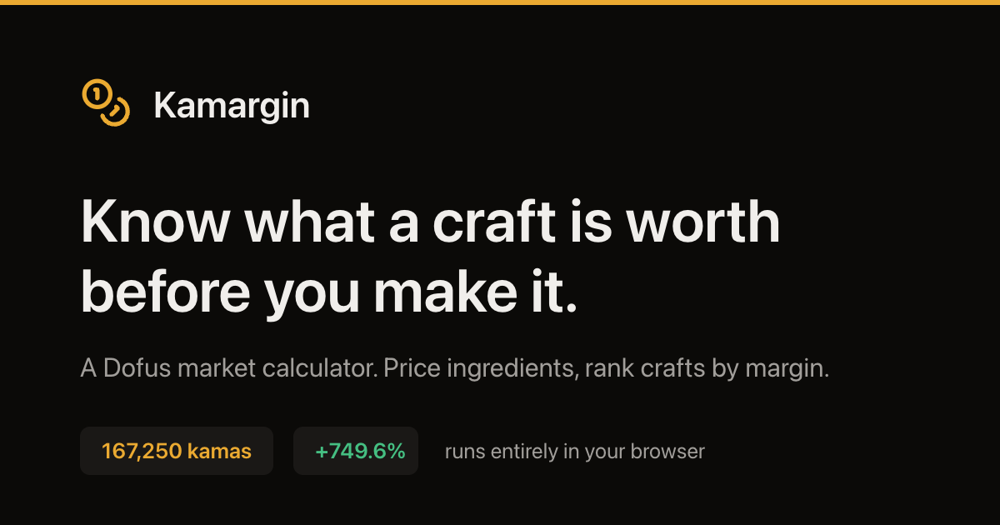
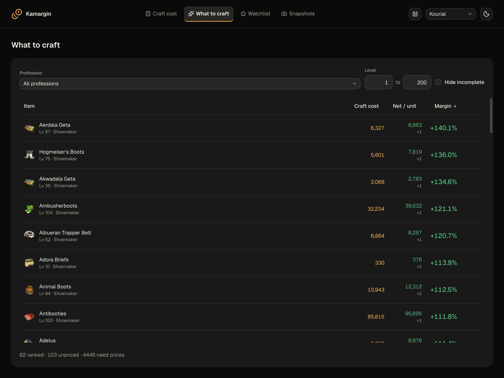
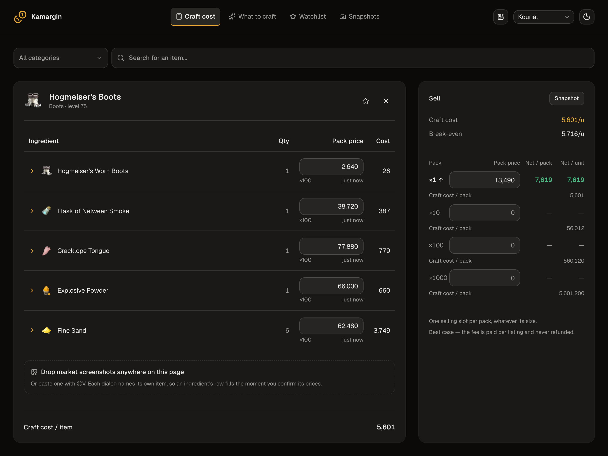

<div align="center">


# Kamargin

**Know what a craft is worth before you make it.**

A client-side market calculator for [Dofus](https://www.dofus.com). Type marketplace prices
or import screenshots, and it costs out every recipe, ranks your profession by margin,
and keeps a record of what a craft was worth when you checked.

[**Open the app →**](https://aghazy94.github.io/kamargin/)

[](https://github.com/AGhazy94/kamargin/actions/workflows/ci.yml)
[](https://github.com/AGhazy94/kamargin/actions/workflows/pages.yml)
[](https://github.com/AGhazy94/kamargin/releases)

</div>

<div align="center">
  
</div>

## Why

The marketplace tells you what an item sells for. It does not tell you what it cost you
to make, which pack size to buy the ingredients in, or which of the hundreds of recipes
your profession can reach is the one worth the slot. Kamargin answers those from prices
you enter once: price an ingredient and **every** recipe that uses it is re-costed.

Everything runs in the browser. No account, no backend, no market-price feed — your
prices live in `localStorage`, per game server, and never leave the device.

## What's in it

| Screen         | What it does                                                                                                          |
| -------------- | --------------------------------------------------------------------------------------------------------------------- |
| **Craft cost** | One recipe, ingredient by ingredient, across all four pack sizes; margin at each sale tier, with the marketplace fee.   |
| **What to craft** | Every recipe your prices can reach, ranked by margin and sortable by cost — plus which ingredient unlocks the most next. |
| **Watchlist**  | The items you keep returning to, each showing its current craft cost, margin and staleness.                              |
| **Snapshots**  | Freeze a craft's figures at today's prices, compare later, restore that price book when you want it back.               |

Prices are entered as **total pack prices** for packs of 1, 10, 100 or 1000; ingredient
cost always uses the cheapest per-unit tier you have entered. Prices older than a day are
badged stale. Nothing is ever silently dropped: a recipe missing an input says how many
inputs it is missing, and offers to take them.



<p align="center"><em>What to craft — every recipe your prices reach, worst-to-best on any column.</em></p>



<p align="center"><em>Craft cost — one recipe, with the margin at each sale tier beside it.</em></p>

> The figures in both screenshots come from made-up prices, not a real market. Retake them with
> `npm run capture:screenshots` while `npm run dev` is up; they double as the manifest screenshots.

## Screenshot import

Drop English-client market-dialog screenshots anywhere on the page, paste them with
`⌘V`/`Ctrl+V`, or use **Import screenshots** in the header to browse. Drop one on an
ingredient row and that row names the item, so matching has nothing left to decide — and a
screenshot that confidently reads as something else says so rather than filling the row.

Each image gets an editable review card with its source image, matched item, pack totals,
average-price reference, and confidence warnings. Nothing is written before **Confirm**.
**Confirm all** skips uncertain cards. Confirmation replaces that item's tiers on the server
selected when the batch opened; **Undo** restores the previous prices and their timestamps
until the sheet closes, unless a newer edit would be overwritten.

Tesseract runs locally. Vendored worker, core, language data, and cache-worker assets total
at most **8,131,466 bytes per browser before compression** on first use. Only one of the
three core variants loads. Worker/core assets persist in CacheStorage and English data in
IndexedDB; a fresh OCR worker works offline after the first successful import. Browsers
can clear or evict that storage. This does not add offline navigation or an app-shell cache.

The review sheet, page-wide drop and paste, the recipe checklist and per-row drop targets
are all in. Manual crop controls and the examples strip remain deferred.

After changing OCR dependencies, run `npm run generate:ocr-assets`; CI verifies the
vendored bytes without downloading anything. Real word-list fixtures can be regenerated
with `npm run capture:ocr-fixtures -- /absolute/path/to/screenshots`. Screenshot originals
stay local; tests use captured word boxes and confidence, without loading WASM.

## Running it

```sh
npm install
npm run dev
```

Vite prints the local URL. The dev server serves the app under the `/kamargin/` base path,
matching the GitHub Pages project site.

| Command             | What it does                             |
| ------------------- | ---------------------------------------- |
| `npm run dev`       | Vite dev server on :5173                 |
| `npm test`          | Vitest, single run                       |
| `npm run typecheck` | types only                               |
| `npm run build`     | typecheck + production build             |
| `npm run check`     | Biome format, lint and import sort, write |
| `npm run knip`      | unused files and dependencies             |
| `npm run ci`        | verify everything, no writes              |

## How it is put together

React, TypeScript, Vite and Tailwind v4, laid out after
[bulletproof-react](https://github.com/alan2207/bulletproof-react/blob/master/docs/project-structure.md)
with `shared → features → app` import boundaries enforced by Biome rather than convention.
UI is shadcn/ui on Base UI. Recipe and item data is bundled ahead of
time from [dofusdu.de](https://api.dofusdu.de) by `npm run generate:game-data`. Item icons are
the only third-party runtime requests, and the app renders without them. OCR assets load
from the site's own origin only after an image is selected.

Routing is hash-based, which is what lets a static host serve deep links and refreshes with
no rewrite rules — and why the Pages deploy needs no SPA fallback.

- `#/` — what the app is, and the way into each screen
- `#/cost?server=kourial&item=910-hogmeisers-boots` — one item on one server
- `#/crafts?server=kourial` — the ranking
- `#/watchlist?server=kourial` · `#/snapshots?server=kourial` — saved records
- `#/snapshots/<id>?server=kourial` — one frozen record

The server is named and the item id leads its own slug, so a shared link reads as itself. Numeric
`?server=355` and `?item=910` still open and are rewritten in place, as are the `#/calculator` and
`#/recommendations` paths these two screens shipped under.

Prices and snapshot payloads stay out of URLs, so a shared link carries a view and never
someone's price book.

## Deploying and releasing

Pushing to the default branch deploys to GitHub Pages, with **Source: GitHub Actions** set
in the repository settings — the legacy branch source would publish the unbuilt `index.html`.

Releases are tag-driven:

```sh
npm version minor
git push --follow-tags
```

The tag runs [`release.yml`](.github/workflows/release.yml), which refuses a tag naming a
version `package.json` disagrees with, then builds, attaches the bundle and opens a release
with notes generated from the commits since the last tag. The version compiles into the
bundle, is shown in the landing-page footer, and is substituted into the page's JSON-LD by a
`transformIndexHtml` hook so the two cannot drift.

Moving to a custom domain is one line — `base` in [vite.config.ts](vite.config.ts) — plus the
absolute URLs in [index.html](index.html).

## Contributing

[AGENTS.md](AGENTS.md) is the source of truth for conventions: project structure, import
boundaries, where tests live, and the comment rules. `npm run ci` is what CI runs.

Feature specs and domain research live in [docs/](docs/) — game mechanics there are verified
against a game version rather than inferred from the code, so read the relevant note before
changing domain logic.

## Licence

MIT. Unofficial, and not affiliated with Ankama. Dofus, item names and item art are Ankama's.
